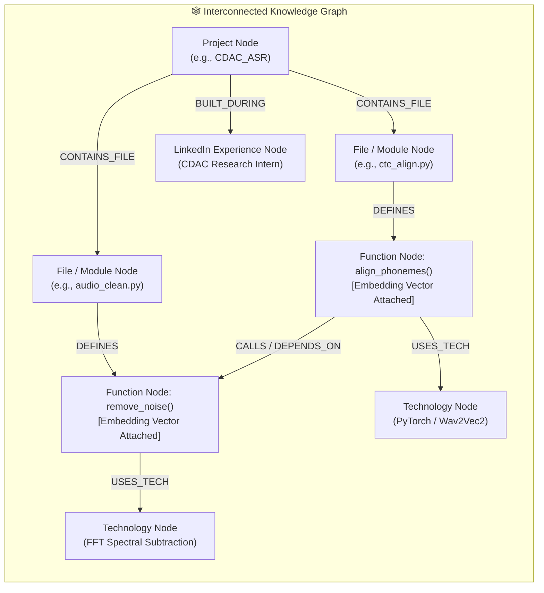

# 🧠 Agentic AI & GraphRAG Architecture Specification

## 1. System Overview

This system provides a stateful **Graph Retrieval-Augmented Generation (GraphRAG)** architecture for Mihir's portfolio. It models projects, modules, functions, classes, call dependencies, technologies, and career milestones as an interconnected Knowledge Graph.

---

## 2. Graph Data Model & Dual-Link Schema

### A. Graph Node Entities

| Node Type | Properties | Dual-Link Vector Field |
| :--- | :--- | :--- |
| **`ProjectNode`** | `id`, `name`, `category`, `live_url`, `repo_url`, `stars`, `year` | Project overview embedding |
| **`FileNode`** | `path`, `repo_id`, `language`, `purpose`, `loc` | File summary embedding |
| **`FunctionNode`** | `symbol_name`, `signature`, `docstring`, `code_snippet`, `file_path`, `repo_id`, `start_line`, `end_line` | **Dense function embedding** (`embedding_vector`) + `node_id` |
| **`TechnologyNode`** | `name`, `category` (ML, Frontend, Backend, Infra), `proficiency` | Technology concept embedding |
| **`ExperienceNode`** | `role`, `organization`, `duration`, `achievements`, `skills` | Experience narrative embedding |

### B. Graph Edge Relationships

1. **`CONTAINS_FILE`**: `(ProjectNode) -> (FileNode)`
2. **`DEFINES_FUNCTION`**: `(FileNode) -> (FunctionNode)`
3. **`CALLS` / `DEPENDS_ON`**: `(FunctionNode A) -> (FunctionNode B)` *(Captures inter-function call hierarchy)*
4. **`IMPORTS`**: `(FileNode A) -> (FileNode B)`
5. **`USES_TECH`**: `(FunctionNode | ProjectNode) -> (TechnologyNode)`
6. **`BUILT_DURING`**: `(ProjectNode) -> (ExperienceNode)`

---

## 3. Workflow & Token Optimization Strategy

To save LLM tokens and streamline compute:
- **One-Time Build on Indexing**: The AST graph and vector embeddings are generated **once when a repository is indexed** (or during the Nightly Midnight Cron job).
- **Zero-Token Graph Traversal**: Queries walk the graph edges locally without making LLM calls for structure discovery.
- **Selective Context Injection**: Only the precise subgraph (the matched function + its direct call dependencies + project metadata) is passed to the chatbot LLM prompt.

---

## 4. Shodh Memory Integration

- **Episodic Memory**: Stores multi-turn user Q&A history and topic threads.
- **Semantic Memory**: Stores user intent (e.g. recruiter evaluating distributed systems vs engineer checking code hygiene).
- **Hierarchical Recall**: Memory is queried before graph retrieval to expand contextual references (*"tell me more about its audio cleaning"* $\rightarrow$ resolves *"its"* to `CDAC_ASR`).

---

## 5. LinkedIn Integration Strategy

- **Primary Source**: Structured dossier snapshot `server/data/linkedin_dossier.json`.
- **Parser**: Converts roles, hackathon wins, and recommendations into `ExperienceNode` items and edges to corresponding `ProjectNode` items.
